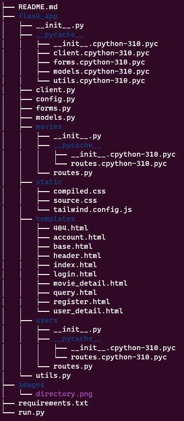

# P4: Movie Ratings Database Pro Max Plus S

**Assigned**: March 5

**Due**: March 15, 11:59 PM

**Late Deadline**: March 18, 11:59 PM

## Description

You will be creating forms, view functions, and finishing templates for adding 
an account system to the project 3 app. For this website, users will have to 
be logged in in order to add comments. Also, we can see all the comments
made by each user by going to their user-detail page.

You will also be using Blueprints to organize the code better

## Setup

The setup of the API key should be complete from project 3.

Activate your virtual environment
Then, to install the necessary packages, run `pip install -r requirements.txt`.

This week we'll be using the 
- `requests`
- `Flask`
- `Flask-MongoEngine` (with `Pillow`)
- `Flask-WTF`
- `Flask-Bcrypt`
- `Flask-Login`
- `python-dotenv`
libraries

## Project

This is the `p4/` directory structure



To run this project, stay in the `p4/` directory and use the `flask run`
command. The file that is run is `run.py`. It simply imports the `app` object
from the `flask_app/` package. The reason we have this new structure is to
avoid the problem of circular imports in Python projects.

In `__init__.py`, apps are now created by calling the
`create_app()` function.

All of the view functions are in `routes.py`. The
database models are in `models.py`, and the `MovieClient` class
is now in `client.py`. The `current_time()` function you used
in the last project is now in `utils.py`, and it's been imported
into `routes.py` for your convenience. Forms are still in `forms.py`.

We create the `db`, `login_manager`, and `movie_client` objects and
initialize them using the `init_app()` function of these extensions.

Then we register the `users` and `movies` blueprints and set
a global 404 error handler function.

The configuration is loaded from `config.py`. Although we don't have many
configuration values for this project, this kind of pattern
is the best practice for when your apps might get more complicated and have lots of configuration values.

**Make sure to set the secret key in 
`config.py`!!!**

**Tasks:**
- Fill out `OMDB_API_KEY` in `__init__.py`
- Fill out `SECRET_KEY` and `MONGODB_HOST` in `config.py`

### routes.py

There are five new template files, corresponding to five
new view functions
in `routes.py`.

- `account.html`
- `login.html`
- `register.html`
- `user_detail.html`
- `404.html`

Now we'll go into detail about each of the new view functions:
1. `account()` - (**Login required**)
  Should be routed at `/account`. Renders the `account.html` template.

    **Tasks:**
    - Add a greeting to the current user (there is a comment showing you where you should add this).
    - The greeting can be anything as long as it contains the current user's username.
      - **Hint:** the current user object is available in every template
    - Create a `UpdateUsernameForm`. (See the `forms.py` section for more info on what should be in the form.)
      - Submitting the username update form should commit a change to the database to change the user's username
      - Create a `UpdateProfilePicForm`. (See the `forms.py` section for more info on what should be in the form.)
     - Submitting the profile picture update form should commit a change to the data to update the user's profile picture.
     - Notice that the user may not have a profile picture so you should handle 2 cases in your form logic: 1) replacing the picture if one already exists 2) adding a profile picture if one doesn't exist
   - Display the user's current profile picture
     - Note that the user may not have a profile picture. You can pass in `None` for the template parameter if this is the case to not render any profile picture.
   - Add a link to view all of the user's reviews (there is a comment showing you where you should add this).
     - Hint: `user_detail(username)` route 

    **Notes:**
    - Images should be displayed using base64, like we did in class.
    - Remember that the arguments to `url_for()` are slightly different when using blueprints.
    - `.modify()` can be used to modify a MongoDB document.
      - Example:
        ```py
        # modify name field of an existing user object
        user = user.modify(name="my new name")
        user.save()
        ```
    - Read the templates to see what arguments to pass in when calling `render_template()`

2. `login()`
   Should be routed at `/login`. Renders the `login.html` template.
   The template has markup for adding a message to the user telling
   them to register (if they don't have an account), for displaying
   a login form, and for showing flashed messages (messages created with
   `flash()` function). 

   **Tasks:**
   - Redirect the user to the `/` route if they're already authenticated (they don't need to see the login page, then).
   - Add `LoginForm` and properly authenticate the user.
     - If they're NOT successfully authenticated, ask the user to authenticate again using `flash()` to flash a message.
     - If they are successfully authenticated, redirect to their `/account` page.

3. `register()`
   Should be routed at `/register`. Renders the `register.html` template.
   The template has markup for asking the user to login if they already have
   an account and for showing the registration form.

   **Tasks:**
   - Redirect the user to the `/` route if they're already authenticated. 
   - Add `RegistrationForm` and create a new account in the database for the user if the form is validated.
     - Make sure to store hashed passwords.

4. `user_detail(username)`
  Should be routed at `/user/<username>`. Renders the `user_detail.html` template.
  The template has markup for indicating whose reviews we're looking at, showing their profile picture, and a space for displaying all reviews.

    **Tasks:**
    - Update the template to render all of the user's reviews.
      - The `movie_title`, `content`, and `date` fields of the `Review` model should be present for each review.
      - Should be able to handle a variable number of reviews (use a loop).
    - If the specified user exists, then render all of the reviews they've written.
    - If the specified user doesn't exist, render an error message.
      - The template has the variable `error` for the error message (`error` can be set to `None` or omitted if there is no error).

5. `logout()` - (**Login required**)
   Should be routed at `/logout`. Doesn't render a template, but
   logs out the current user. 
   
   **Tasks:**
   - log out the current user
   - redirect to the `/` route

6. `movie_detail()`
   On the `movie_detail()` page, where users can enter reviews, show each commenter's profile picture next to their review. 
   You are allowed to change the implementation but you're not required to.

   **Tasks:** none

7. `custom_404()`
   Add a custom 404 page. The barebones `custom_404()` function is provided in `__init__.py`. You
   should add the necessary decorators and other functionality to
   this function in order render a custom 404 page. 
   
   **Tasks:**
   - add HTML/Jinja code to create the custom page
     - include the website header (i.e. extend `header.html`)
     - include a message informing the user about the 404 error
     - include a link back to the index page

Additionally, for each view function for which we indicated **login required**,
use the `login_required()` decorator from `Flask-Login`.
Don't add `login_required()` to any other routes. 

### Profile pics

To show user's profile pictures, we added the HTML/CSS code necessary to make the
profile pictures render nicely. You just have to:
- Supply the base64-encoded images to `render_template` in the way the template expects
  them. 

### forms.py

In `forms.py`, we've included the code for the `RegistrationForm`
since we already discussed the implementation in class. We modified
the `MovieReviewForm` since users no longer have to enter their name;
it automatically gets added, since they're logged in when they're 
adding a review. You have to implement the `LoginForm`, `UpdateUsernameForm`, and
`UpdateProfilePicForm`.

1. `LoginForm` 

    Fields:
    - `username`: required field
    - `password`: required field (make sure it appears as a password field that hides user input)
    - `submit`: submit field 
2. `UpdateUsernameForm`:
   
   Fields:
   - `username`: required field
     - new username must be between 1 and 40 (inclusive) characters long
     - Use a custom validator to validate that the username isn't already taken.
   - `submit_username`: submit field

3. `UpdateProfilePicForm`:

    Fields:
    - `picture`: a required `FileField`
      - only allows images of types `jpg` and `png`
    - `submit_picture`: submit field

### models.py

In `models.py`, you have to implement the `User` and `Review` 
document models. You also have to implement the user loader function, which
is used by `Flask-Login` in order to retrieve the current user object.
1. `User` - Should have these fields:
   - `username`: required and unique with minimum length 1 and maximum length 40 characters
   - `email`: required and unique 
   - `password`: required (only store slow-hashed passwords!)
   - `profile_pic`: optional
   - you should implement the `get_id()` method of `User` and `load_user(user_id)`
     - `get_id()` needs to return a string unique to each user and `load_user(user_id)` fetches a `User` object using that unique string
     - use the user's username for this unique string
2. `Review` - Should have these fields:
   - `commenter`: required reference to a `User`
     - hint: https://docs.mongoengine.org/apireference.html#mongoengine.fields.ReferenceField
   - `content`: required with minimum length 5 and maximum length 500 characters.
   - `date`: required (can be saved as a string instead of a datetime)
   - `imdb_id`: required with length 9
   - `movie_title`: required with minimum length 1 and maximum length 100

## Testing

### Functionality

When your current directory is `p4/`, you can run the command `flask run`
in your terminal or command line to see your website. This
will use the `run.py` file.

We've listed all the requirements above, in high detail. Make sure you fill
out all of those requirements, and that you display errors relevant to each
page properly, and that the `current_user` object is used where needed.


## Submission

Assure that you've tried out all the different things that could go wrong and that they
are behaving appropriately (and the things that are supposed to work, still do), and
errors are shown when they are supposed to be shown.

For submission, submit a .zip to gradescope.
**The directory, along with its contents, should be zipped, not the contents of the directory.**
In other words, when we unzip your file, we should see the `p4/` directory. If you
have any questions, please ask in Discord.

If you don't submit according to the instructions above, you may lose **up to 25%** of your
score on this project.

## Grading

If you don't use MongoDB, you will get a 0 on this project.


These requirements include requirements from project 3 as well as functionality
we implemented. Since this project is an extension of project 3 where we're
adding user management, the provided functionality still has to work properly.
All of these features have already been implemented.
This rubric item is for you to make sure that the functionality we gave you is 
still working after you add *your* changes.

| Requirement                                        | Points |
| -------------------------------------------------- | ------ |
| Secret Key Set                                     | 5      |
| Search form rendered with input validators         | 10     |
| Search form input validator errors shown on page   | 5      |
| Query results show up after submitting search form | 15     |
| Review form rendered with input validators         | 10     |
| Review form input validator errors shown on page   | 5      |
| Review form has multi-line input for review        | 5      |
| Reviews are shown after submitting review form     | 10     |
| Review are shown per movie (unique per movie)      | 15     |
| Reviews are inserted into MongoDB                  | 10     |
| Reviews are read from MongoDB                      | 10     |

These requirements are 100 points

New project 4 requirements:

| Requirement                                                                       | Points      |
| --------------------------------------------------------------------------------- | ----------- |
| `UpdateUsernameForm` works according to the specifications                        | 15          |
| `UpdateProfilePicForm` works according to specifications                          | 10          |
| Profile pictures seen on account, user detail, and movie detail pages.            | 15 (5 each) |
| Views that require login, do require login                                        | 10          |
| Account page has greeting and link to current user's reviews                      | 10          |
| User detail page lists all reviews, all other necessary information/functionality | 20          |
| Log-in functionality works, contains necessary elements                           | 20          |
| Registration functionality works, contains necessary elements                     | 20          |
| Logout works and redirects user                                                   | 10          |
| Custom 404 page implemented, contains necessary elements                          | 10          |
| Logged-in users redirected away from login and registration pages                 | 10          |
| The three forms you implement have the correct names and validators               | 15 (5 each) |
| User loader function implemented                                                  | 5           |
| `User` class has all necessary fields with correct validators                     | 15          |
| `Review` class has all necessary fields with correct validators                   | 15          |

These requirements are 200 points.

### In total, there are 300 points.

